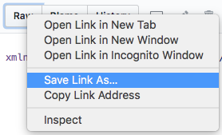
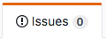
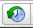
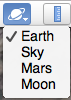

Данный репозиторий создан для более удобной работы по созданию общей базы пирамид (и пока находится в процессе доработки).

# Новости

## Что уже добавлено
- Добавлены метки от Lada
- Пирамиды в Антарктиде
  - 2 штуки рядом с [новой (2004) магнитной обсерваторией–станцией принцессы Елизаветы (Princess Elisabeth Station)](http://www.antarcticstation.org/science)
  
    - плохо видны на снимков с космоса, на на фото со станции видны хорошо
    - [ссылка на статью с большим количеством фото](http://sibved.livejournal.com/152355.html)
      - [ссылка на видео такого же ищущего пирамиды](http://wordscience.org/v-antarktide-uchenye-obnaruzhili-tri-zagadochnye-piramidy.html). Надо бы найти его метки...
- Метки от saha и austria
- Geolines.ru
  - все файлы объединены в один и немного обработаны (убраны лишние папки, названия переведены местами и т.д.)
  - создан отдельный файл с пирамидами: [`база-пирамид.kml`](рабочие-файлы/база-пирамид.kml) (можно кликнуть – см. как скачать ниже)
  - надо будет ещё раз пересмотреть полный файл – [`geolines-ru-полный.kml`](рабочие-файлы/geolines-ru-полный.kml), т.к. я его лишь поверхностно просмотрел, может что-то упустил, надо пересмотреть и удалить не пирамиды
  - также, не знаю что делать с объектами Майя (и других коренных жителей Южной/Северной Америки) – тоже надо глянуть и добавить те, которые похожи на пирамиды

## В планах
- Статья про пирамиды Египта – всё сохранить в файл
  - И удалить повторы
- Проверить сайты
  - [Карта расположения всех пирамид на Земле](http://lah.flybb.ru/topic1785.html)
  - [Мировая система пирамид.](http://www.kosmm.ru/arl6.html)
    - [уже выложено](http://home.hiwaay.net/~jalison/index.html) и далее по ссылкам
  - http://sibved.livejournal.com/tag/Пирамиды
  - http://www.tart-aria.info/frantsiya-piramida-le-pertus-pod-sloem-gliny/
  - http://www.tart-aria.info/piramidalnye-holmy-terrikony/
  - https://ru.wikipedia.org/wiki/%D0%A1%D0%BF%D0%B8%D1%81%D0%BE%D0%BA_%D0%B5%D0%B3%D0%B8%D0%BF%D0%B5%D1%82%D1%81%D0%BA%D0%B8%D1%85_%D0%BF%D0%B8%D1%80%D0%B0%D0%BC%D0%B8%D0%B4
  - http://xn--e1adcaacuhnujm.xn--p1ai/drevnie-piramidy-mira-sistema-ili-sovpadenie.html
  - http://sirderya.blogspot.com/2013/12/ilim-cinde-de-olsa-gidip-alnz.html
    - http://www.onemforum.com/dunya-sehirleri-resim/375784-beyaz-piramitlerin-google-earth-goruntusu.html
  - http://www.kazan-newage.ru/sila/81-egi769petskie-pirami769d.html
  - http://www.exomapia.ru/places/281713
  - http://piramidainfo.net/map.php
  - http://www.world-pyramids.com/
  - http://hghltd.yandex.net/yandbtm?fmode=inject&url=http%3A%2F%2Fwww.mir.h19.ru%2Fxronologiya%2F16-WhiteGods%2Fimg%2Ffoto.php%3Fpgnum%3D49&tld=ru&lang=ru&la=1492602112&tm=1493745767&text=url%3Amir.h19.ru%2Fxronologiya%2F16-WhiteGods%2Fimg%2Ffoto.php%3Fpgnum%3D49%20%7C%20url%3Awww.mir.h19.ru%2Fxronologiya%2F16-WhiteGods%2Fimg%2Ffoto.php%3Fpgnum%3D49&l10n=ru&mime=html&type=touch&sign=629dd6c200aafda637770bd5c163dbca&keyno=0
  - http://lah.flybb.ru/topic455.html
  - http://lah.flybb.ru/topic1785.html
  - https://www.google.com/maps/d/viewer?mid=19FJI3bP6wwTP5Hcvk5DKkFCbOyk
  - http://lifeglobe.net/entry/1582
  - http://turbina.ru/q/advice/69771/
  - https://slavmaps.ru/spisok
  - http://doublepyramid.org/zagadka-drevnih-piramid-na-kolskom-poluostrove/
  - http://taboo.su/istoriya/zapretnaya-arkheologiya/74-kompleksy/233-teotiuakan-kompleks-piramid-v-meksike.html
  - http://taboo.su/istoriya/zapretnaya-arkheologiya/74-kompleksy/193-ninchurt.html
  - http://www.kosmm.ru/arl4.html

# ЧаВо? (ЧАсто задаваемые ВОпросы)
## Как скачать...
### все файлы?
Через кнопку [`Download .zip`](https://github.com/rgdn-info-community/piramidy/zipball/master)
- вам нужна папка [`база-пирамид`](база-пирамид), где лежат файлы с расширением `.kml`
- остальные файлы/папки нужны для сайта и для самого репозитория гитхаба

### один файл?
- перейдите в папку [`база-пирамид`](база-пирамид)
- найдите нужный файл
- на следующей странице откройте контекстное меню (левая кнопка мыши/трэкпада/пр.) у кнопки  и выберете пункт `Сохранить содержимое как...` (название зависит от браузера/языка)

- укажите куда сохранить

## Как зарегистрироваться и начать работу?
1\. создаёте аккаунт (sign up) на сайте [гитхаба](https://github.com) 
  

  - выбираете название аккаунта (`username`)
  - вводите свою почту и пароль

2\. после регистрации:

  - переходите на страницу [`rgdn-info-community/pyramidy`](https://github.com/rgdn-info-community/piramidy)
  - и нажимаете на кнопку `Watch (Следить)`   
  - тем самым вы ещё и будете получать уведомления о работе над репозиторием на главной странице своего гитхаб-аккаунта

3\. работа с файлами

  - пока я вас ещё не добавил (в организацию [`rgdn-info-community`](https://github.com/rgdn-info-community/)), вы не можете добавлять/редактировать файлы, но вы можете скачать их и начать работать с ними
  - когда я вас уже добавил, переходите к следующим пунктам

*Примечание: если вы знакомы с git, можете форкнуть репозиторий и время от времени присылать запросы на слияние. А может лучше просто ветку сделать? Или вообще только на мастере всем работать? Если кто знает – подскажите, пожалуйста, как лучше.*

## Как добавлять свои файлы?
Заходите в папку [`рабочие файлы`](рабочие-файлы) и просто перетаскиваете файл в окно браузера, при этом окошко должно измениться. Если нет, то у все всё ещё нет доступа к редактированию.  

**Желательно**, чтобы файл был с расширением `.kml` – это незаархивированный файл с вашими отметками пирамид (`.kmz` – этот тот же `.kml` файл, только в архиве).

## Как обновлять файл с текущей базой?
До того, как создавать единую базу, надо продумать, каким должен быть название, т.е. идентификатор пирамид. Это поможет избежать повторов и сделает базу более организованной. Предлагаю:

- в качестве названия использовать первые три цифры координат (надо выбрать между вариантом с градусами или без)
- если у пирамиды есть название, его можно указать после идентификатора

Легче всего это сделать в программе Google Earth – там можно создавать папки с вашими заметками, копировать, вырезать и вставлять их. Открываете ваш файл и текущую базу пирамид, и `Ctrl+C`, `Ctrl+V` (`Cmd` для макинтош).

Пока это буду делать я, а если людей будет много, то я опишу как делать с помощь механизмов гита (с помощью веток (branches) или ответвлений (forks)).

*Примечание: Если вы знаете, что `.kml` это обычный `XML`-файл, то можете его редактировать в любом текстовом редакторе.*

## Есть предложение? Что-то не работает?
Для того, чтобы задать вопрос, надо сделать следующее:
- нажать на закладку , а затем на кнопку 
- набрать название и текст с описанием проблемы
- нажать на кнопку 

# А вы знаете, что...
- В приложении Google Earth можно увидеть карты за разные моменты времени? Надо лишь нажать на кнопку 
- В Google Earth можно и на звёзды посмотреть, причём с картинками от НАСА и др. товарищей вместе с заметками. Надо лишь нажать на символ планеты  и появится список:  

# План работы по сайту
- готов к вашим предложениям, дорогие друзья
- добавление карты с Google.Maps для визуализации проделанной работы я пока отложил в долгий ящик – если кто-то сможет помочь с организацией сего – напишите мне, пожалуйста
