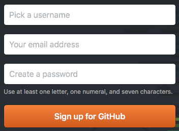
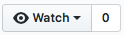
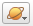

Данный репозиторий создан для более удобной работы по созданию общей базы пирамид (и пока находится в процессе доработки).

# Что уже добавлено
## Geolines.ru
- все файлы объединены в один и немного обработаны (убраны лишние папки, названия переведены местами и т.д.)
- создан отдельный файл с пирамидами: [`база-пирамид.kml`](рабочие-файлы/база-пирамид.kml) (можно кликнуть – см. как скачать ниже)
- надо будет ещё раз пересмотреть полный файл – [`geolines-ru-полный.kml`](рабочие-файлы/geolines-ru-полный.kml), т.к. я его лишь поверхностно просмотрел, может что-то упустил, надо пересмотреть и удалить не пирамиды
- также, не знаю что делать с объектами Майя (и других коренных жителей Южной/Северной Америки) – тоже надо глянуть и добавить те, которые похожи на пирамиды

## Метки от saha и austria

# ЧаВо? (ЧАсто задаваемые ВОпросы)
## Как скачать...
### все файлы?
Через кнопку [`Download .zip`](https://github.com/rgdn-info-community/piramidy/zipball/master)
- вам нужна папка [`база-пирамид`](база-пирамид), где лежат файлы с расширением `.kml`
- остальные файлы/папки нужны для сайта и для самого репозитория гитхаба

### один файл?
- перейдите в папку [`база-пирамид`](база-пирамид)
- найдите нужный файл
- на следующей странице откройте контекстное меню (левая кнопка мыши/трэкпада/пр.) у кнопки  и выберете пункт `Сохранить содержимое как...` (название зависит от браузера/языка)

- укажите куда сохранить

## Как зарегистрироваться и начать работу?
1\. создаёте аккаунт (sign up) на сайте [гитхаба](https://github.com) 
  

  - выбираете название аккаунта (`username`)
  - вводите свою почту и пароль

2\. после регистрации:

  - переходите на страницу [`rgdn-info-community/pyramidy`](https://github.com/rgdn-info-community/piramidy)
  - и нажимаете на кнопку `Watch (Следить)`   
  - тем самым вы ещё и будете получать уведомления о работе над репозиторием на главной странице своего гитхаб-аккаунта

3\. работа с файлами

  - пока я вас ещё не добавил (в организацию [`rgdn-info-community`](https://github.com/rgdn-info-community/)), вы не можете добавлять/редактировать файлы, но вы можете скачать их и начать работать с ними
  - когда я вас уже добавил, переходите к следующим пунктам

*Примечание: если вы знакомы с git, можете форкнуть репозиторий и время от времени присылать запросы на слияние. А может лучше просто ветку сделать? Или вообще только на мастере всем работать? Если кто знает – подскажите, пожалуйста, как лучше.*

## Как добавлять свои файлы?
Заходите в папку [`рабочие файлы`](рабочие-файлы) и просто перетаскиваете файл в окно браузера, при этом окошко должно измениться. Если нет, то у все всё ещё нет доступа к редактированию.  

**Желательно**, чтобы файл был с расширением `.kml` – это незаархивированный файл с вашими отметками пирамид (`.kmz` – этот тот же `.kml` файл, только в архиве).

## Как обновлять файл с текущей базой?
До того, как создавать единую базу, надо продумать, каким должен быть название, т.е. идентификатор пирамид. Это поможет избежать повторов и сделает базу более организованной. Предлагаю:

- в качестве названия использовать первые три цифры координат (надо выбрать между вариантом с градусами или без)
- если у пирамиды есть название, его можно указать после идентификатора

Легче всего это сделать в программе Google Earth – там можно создавать папки с вашими заметками, копировать, вырезать и вставлять их. Открываете ваш файл и текущую базу пирамид, и `Ctrl+C`, `Ctrl+V` (`Cmd` для макинтош).

Пока это буду делать я, а если людей будет много, то я опишу как делать с помощь механизмов гита (с помощью веток (branches) или ответвлений (forks)).

*Примечание: Если вы знаете, что `.kml` это обычный `XML`-файл, то можете его редактировать в любом текстовом редакторе.*

## Есть предложение? Что-то не работает?
Для того, чтобы задать вопрос, надо сделать следующее:
- нажать на закладку , а затем на кнопку 
- набрать название и текст с описанием проблемы
- нажать на кнопку 

# А вы знаете, что...
- В приложении Google Earth можно увидеть карты за разные моменты времени? Надо лишь нажать на кнопку 
- В Google Earth можно и на звёзды посмотреть, причём с картинками от НАСА и др. товарищей вместе с заметками. Надо лишь нажать на символ планеты  и появится список:  

# Мой план работы
- Собрать информацию, которая уже есть в интернете
  - найти различные источники
- Доработать сайт на базе репозитория
  - готов к вашим предложениям, дорогие друзья
  - добавление карты с Google.Maps для визуализации проделанной работы я пока отложил в долгий ящик – если кто-то сможет помочь с организацией сего – напишите мне, пожалуйста
