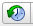

Данный репозиторий создан для более удобной работы по созданию общей базы пирамид (и пока находится в процессе доработки).

# Что уже добавлено
## Geolines.ru
- все файлы объединены в один и немного обработаны (убраны лишние папки, названия переведены местами и т.д.)
- создан отдельный файл с пирамидами: [`pyramids-database.kml`](рабочие-файлы/pyramids-database.kml) (можно кликнуть)

Этот файл не полный и туда пока попали также и не пирамиды
  - TODO: надо отсортировать и дополнить из полного файла: [`geolines-ru-complete.kml`](рабочие-файлы/geolines-ru-complete.kml)

# ЧаВо? (ЧАсто задаваемые ВОпросы)
## Как скачать... 
### все файлы?
Через кнопку [`Download .zip`](https://github.com/rgdn-info-community/piramidy/zipball/master) вверху этой страницы.
- вам нужна папка [`рабочие файлы`](рабочие-файлы), где лежат файлы с расширением .kml
- остальные файлы/папки нужны для сайта и для самого репозитория гитхаба
### один файл?
- перейдите в папку [`рабочие файлы`](рабочие-файлы)
- найдите нужный файл, кликните на него
- на следующей странице откройте контекстное меню (левая кнопка мыши/трэкпада/пр.) у кнопки  и выберете пункт `Сохранить содержимое как...` (название зависит от браузера/языка)

- укажите куда сохранить

## Как зарегистрироваться?
1. создаёте аккаунт (sign up) на сайте [гитхаба](https://github.com) 
  

  - выбираете название аккаунта (username)
  - вводите свою почту и пароль
2. после регистрации:
  - переходите на страницу [`rgdn-info-community/pyramidy`/piramidy](https://github.com/rgdn-info-community/piramidy)
  - и нажимаете на кнопку `Watch` (Следить)   
  - тем самым вы ещё и будете получать уведомления о работе
3. пока я вас ещё не добавил (в организацию rgdn-info-community), вы не можете загружать свои или редактировать уже имеющиеся файлы
затем есть два варианта работы:
  - пока я вас ещё не добавил (в организацию [`rgdn-info-community`](https://github.com/rgdn-info-community/)), вы не можете добавлять/редактировать файлы, но вы можете скачать их и начать работать с ними
  - когда я вас уже добавил, переходите к следующим пунктам

*примечание: если вы знакомы с гит, можете сделать fork (ответвление) репозитория и потом отправлять pull request (пул-запрос), когда что-то будет готово*

## Как добавлять свои файлы?
Заходите в папку [`рабочие файлы`](рабочие-файлы) и просто перетаскиваете файл в окно браузера, при этом окошко должно измениться. Если нет, то у все всё ещё нет доступа к редактированию.  
**Желательно**, чтобы файл был расширения .kml – это незаархивированный файл с вашими отметками пирамид (.kmz – этот тот же .kml файл, только в архиве).

## Как редактировать файлы?
Легче всего это сделать в программе Google Earth – там можно создавать папки, копировать, вырезать и вставлять их.  
Если будет много людей работать над проектом, можно потом будет использовать возможности гит для этого. Посмотрим.

## Есть предложение? Что-то не работает?
Для того, чтобы задать вопрос, надо сделать следующее:
- нажать на закладку , а затем на кнопку 
- набрать название и текст с описанием проблемы
- нажать на кнопку 

# А вы знаете, что...
- В приложении Google Earth можно увидеть карты за разные моменты времени? Надо лишь нажать на кнопку 
- В Google Earth можно и на звёзды посмотреть, причём с картинками от НАСА и др. товарищей вместе с заметками. Надо лишь нажать на символ планеты  и появится список:  

# Мой план работы
- Собрать информацию, которая уже есть в интернете
  - найти различные источники
- Доработать сайт на базе репозитория
  - готов к вашим предложениям, дорогие друзья
  - добавление карты с Google.Maps для визуализации проделанной работы я пока отложил в долгий ящик – если кто-то сможет помочь с организацией сего – напишите мне, пожалуйста
